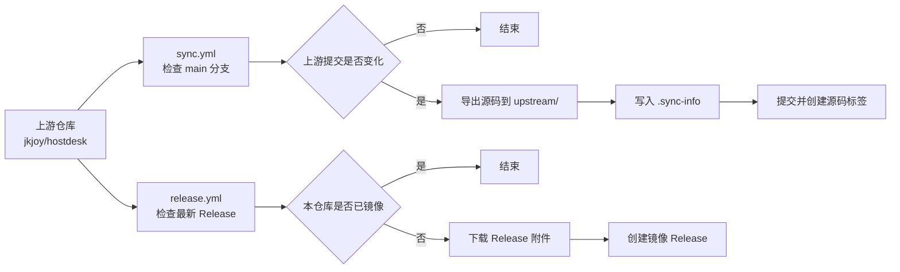

<div align="center">

# hostdesk-mirror

HostDesk 上游仓库的源码与 Release 文件镜像

[](https://github.com/jkjoy/hostdesk)
[](https://github.com/jkjoy/hostdesk/tree/main)
[](https://github.com/hopol/hostdesk-mirror/actions/workflows/sync.yml)
[](https://github.com/hopol/hostdesk-mirror/actions/workflows/release.yml)
[](LICENSE)

[上游仓库](https://github.com/jkjoy/hostdesk) · [镜像 Releases](https://github.com/hopol/hostdesk-mirror/releases) · [Actions](https://github.com/hopol/hostdesk-mirror/actions)

</div>

---

## 📌 说明

本仓库用于镜像 [`jkjoy/hostdesk`](https://github.com/jkjoy/hostdesk) 的源码和 GitHub Release 文件。

- 源码来自上游 `main` 分支，导出到 `upstream/`。
- Release 文件来自上游最新 GitHub Release，并重新发布到本仓库的 Releases。
- 本仓库不修改上游源码，不重新构建二进制文件，也不提供 HostDesk 的官方支持。

> [!NOTE]
> 上游项目是用于 Linux 服务器管理的 Web SSH 终端，提供文件管理、容器管理、服务管理、监控和终端等功能。功能说明、安装方式、更新内容和使用要求请以上游仓库为准。

## 📁 镜像范围

| 内容 | 位置 | 说明 |
|---|---|---|
| 上游源码 | `upstream/` | 通过 `git archive` 从上游 `main` 分支导出。 |
| 同步信息 | `upstream/.sync-info` | 记录上游提交、同步时间、分支和来源引用。 |
| 源码标签 | `mirror-source-{短提交}` | 对应一次源码同步。 |
| Release 文件 | 本仓库 Releases | 下载自上游 GitHub Release。 |
| Release 标签 | `mirror-release-{上游标签}` | 对应一个上游 Release。 |

## 🔄 自动同步

本仓库包含两个 GitHub Actions 工作流：



| 工作流 | 文件 | 默认时间（UTC） | 用途 |
|---|---|---:|---|
| 同步源码 | `.github/workflows/sync.yml` | 02:00 | 检查上游 `main` 分支，发现新提交后更新 `upstream/`。 |
| 镜像 Release | `.github/workflows/release.yml` | 02:37 | 检查上游最新 Release，发现未镜像的版本后下载附件并创建本仓库 Release。 |

两个工作流都支持在 Actions 页面手动运行。

> [!IMPORTANT]
> GitHub Actions 中的定时任务使用 UTC 时间。当前 cron 表达式的日期字段为 `*/5`，实际运行日期通常是每月 1、6、11、16、21、26、31 日，不等同于严格每 5 天运行一次。

## 🧾 同步信息

每次源码同步后，`upstream/.sync-info` 会写入类似内容：

```ini
commit=0123456789abcdef...
timestamp=2026-08-07T00:00:00Z
upstream_url=https://github.com/jkjoy/hostdesk
upstream_branch=main
source_ref=v2.1.6-3-g0123456
```

| 字段 | 含义 |
|---|---|
| `commit` | 上游 `main` 分支的提交哈希。 |
| `timestamp` | 同步时间，UTC。 |
| `upstream_url` | 上游仓库地址。 |
| `upstream_branch` | 同步分支。 |
| `source_ref` | `git describe --tags` 得到的最近上游标签及相对提交信息；若没有可用标签，则为提交哈希。 |

HostDesk 源码中没有独立的版本清单文件，因此镜像不会猜测版本号；`.sync-info` 中的 `source_ref` 和 `commit` 用于追溯源码来源。

同步脚本会先读取已提交的 `.sync-info`，再判断上游提交是否变化。只有提交不同才会更新 `upstream/` 并创建新的提交和标签。

## 💻 本地同步源码

`sync.sh` 可用于本地手动同步源码；它不会处理 Release 文件。

### 要求

- Git；
- Bash 环境，例如 Linux、macOS、WSL 或 Git Bash；
- 能访问 GitHub；
- 如需推送结果，需要对本仓库有写入权限。

### 使用方式

```bash
git clone https://github.com/hopol/hostdesk-mirror.git
cd hostdesk-mirror
chmod +x sync.sh
./sync.sh
```

脚本会执行以下操作：

1. 确认或添加 `upstream` 远程；
2. 拉取上游 `main` 分支和标签；
3. 对比上次记录的上游提交；
4. 如有变化，重新导出 `upstream/`；
5. 写入 `.sync-info`，提交变更，创建并推送源码镜像标签。

### 同步配置

```bash
UPSTREAM_URL="https://github.com/jkjoy/hostdesk.git"
UPSTREAM_WEB_URL="https://github.com/jkjoy/hostdesk"
UPSTREAM_BRANCH="main"
MIRROR_REPO="https://github.com/hopol/hostdesk-mirror"
```

如果修改同步来源或分支，请同时检查 GitHub Actions 工作流中的对应变量。

## 🚀 Release 镜像

`release.yml` 会读取上游最新 Release，并按下面的规则创建本仓库 Release：

- 本仓库标签名：`mirror-release-{上游标签}`；
- Release 标题包含上游 Release 名称；
- Release 说明中包含上游 Release 链接和上游原始说明；
- 附件直接来自上游 Release 下载结果。

> [!WARNING]
> 本仓库不会校验、重签名或重新打包这些附件。下载和使用前请自行确认来源、版本和文件完整性。

## 🛠️ 维护常用命令

```bash
# 查看远程仓库
git remote -v

# 查看当前镜像对应的上游提交
git show HEAD:upstream/.sync-info

# 列出镜像标签
git tag -l 'mirror-*'

# 手动拉取上游 main 分支
git fetch upstream main --tags
```

## ❓ 常见问题

| 问题 | 处理方式 |
|---|---|
| Actions 无法推送提交或标签 | 检查仓库 Settings → Actions → General 中的 Workflow permissions，确保 `GITHUB_TOKEN` 有写入权限。 |
| 定时任务没有准时运行 | GitHub scheduled workflow 可能延迟，且时间按 UTC 计算。 |
| 获取不到上游分支 | 确认上游仍然存在 `main` 分支，并检查网络访问。 |
| Release 创建失败 | 查看 Actions 日志，重点检查 GitHub API、`GITHUB_TOKEN` 权限和上游 Release 附件下载结果。 |
| 源码同步每次都产生提交 | 检查 `upstream/.sync-info` 是否已提交，以及工作流是否在删除 `upstream/` 前读取旧记录。 |

## ⚖️ 许可证

本仓库的同步脚本、GitHub Actions 工作流和文档采用 [MIT License](LICENSE)。

`upstream/` 中的文件来自上游项目。上游仓库当前未在根目录提供许可证文件；使用、复制或再分发其中内容前，请先向上游作者确认授权范围，并遵守第三方依赖的许可证和服务条款。

---

<div align="center">

本仓库只是镜像，不是 HostDesk 官方仓库。

[返回顶部](#hostdesk-mirror)

</div>
